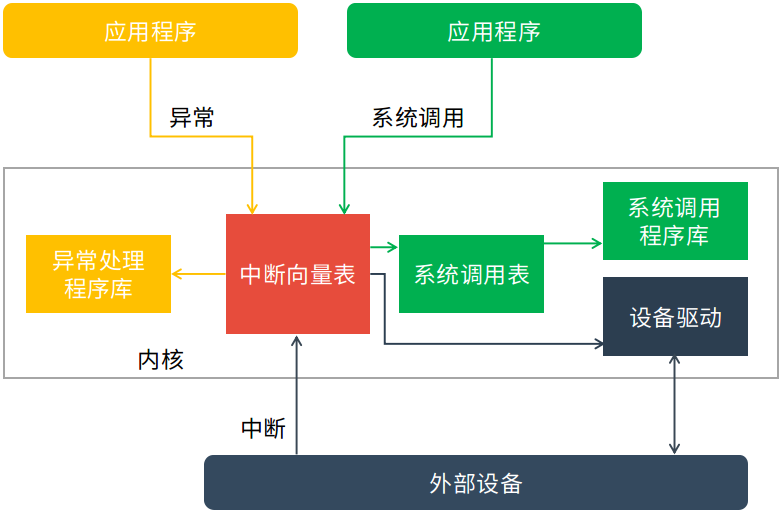

# 什么是中断机制？
>本文是`操作系统系列`第五篇，介绍操作系统中的中断机制和系统调用。更多内容见公号`机器学习与系统`，欢迎与我互动~

## 概念
操作系统需要管理外设，但是外设的速度远远低于CPU的速度，所以我们需要一种机制来弥补这种速度鸿沟，提高CPU的效率。

因此我们引入了中断机制，让外设在需要操作系统处理外设相关事件的时候，能够“主动通知”操作系统，即打断操作系统和应用的正常执行，让操作系统完成外设的相关处理，然后在恢复操作系统和应用的正常执行。

当CPU收到中断或者异常的事件时，它会暂停执行当前的程序或任务，通过一定的机制跳转到负责处理这个信号的相关处理例程中，在完成对这个事件的处理后再跳回到刚才被打断的程序或任务中。

## 分类
1. 异步中断(asynchronous interrupt)，由CPU外部设备引起的外部事件如I/O中断、时钟中断、控制台中断等是异步产生的（即产生的时刻不确定），与CPU的执行无关。也称外部中断,简称中断(interrupt)。
2. 同步中断(synchronous interrupt)，在CPU执行指令期间检测到不正常的或非法的条件(如除零错、地址访问越界)所引起的内部事件称作，也称内部中断，简称异常(exception)。
3. 陷入中断(trap interrupt)，在程序中使用请求系统服务的系统调用而引发的事件，也称软中断(soft interrupt)。

|          |             中断             |                  异常                  |  系统调用  |
| :------: | :--------------------------: | :------------------------------------: | :--------: |
|   源头   |             外设             |                应用程序                |  应用程序  |
| 响应方式 |             异步             |                  同步                  | 异步或同步 |
| 处理机制 | 持续，对用户应用程序是透明的 | 杀死或者重新执行意想不到的应用程序指令 | 等待和持续 |

## 中断描述符表
也称中断描述符表(Interrupt Descriptor Table)。

在操作系统中，会预先设置一些中断处理函数，当CPU接收到中断时，会根据中断号去查找对应的处理函数，中断向量表就是记录中断号和处理函数映射关系的表。

中断处理机制如下：

中断、异常和系统调用都由**中断向量表**协调执行。
1. 发生中断时，根据中断向量号查询中断向量表，根据里面的处理程序，协调设备驱动处理外部设备的中断请求
2. 发生系统调用请求时，中断向量表查询系统调用表，然后执行对应的系统调用程序
3. 发生异常时，查询中断向量表得到对应异常处理程序，处理异常

## 总结
中断机制是为了弥补CPU速度和外设速度数量级差异的机制，它的核心是中断向量表。本文只介绍概念和简单的机制，没有深入介绍中断过程中特权级转换等内容，有兴趣的同学可以查看清华大学的[操作系统课程](https://chyyuu.gitbooks.io/ucore_os_docs/content/lab1/lab1_3_3_2_interrupt_exception.html)。