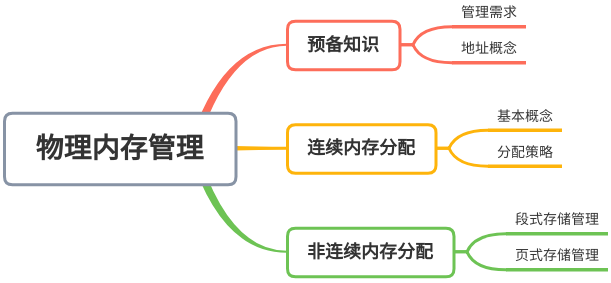
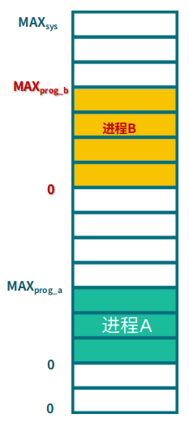
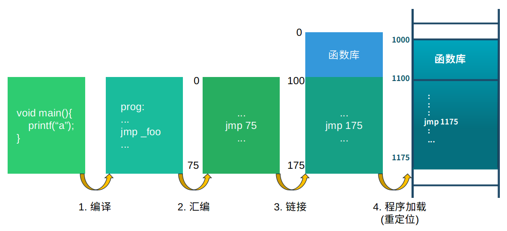
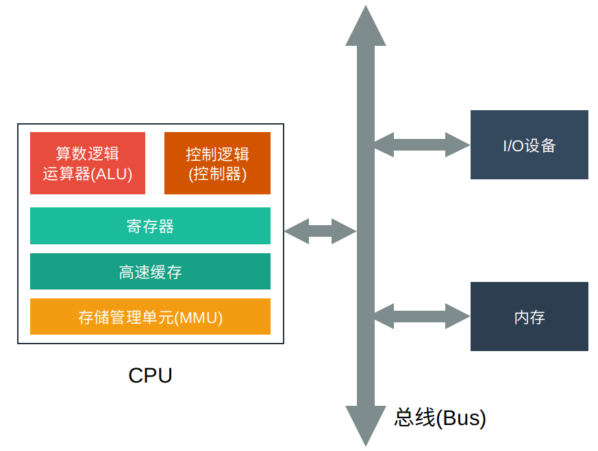
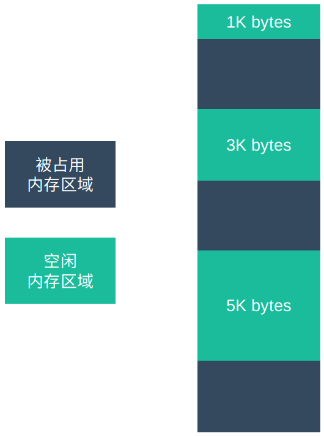
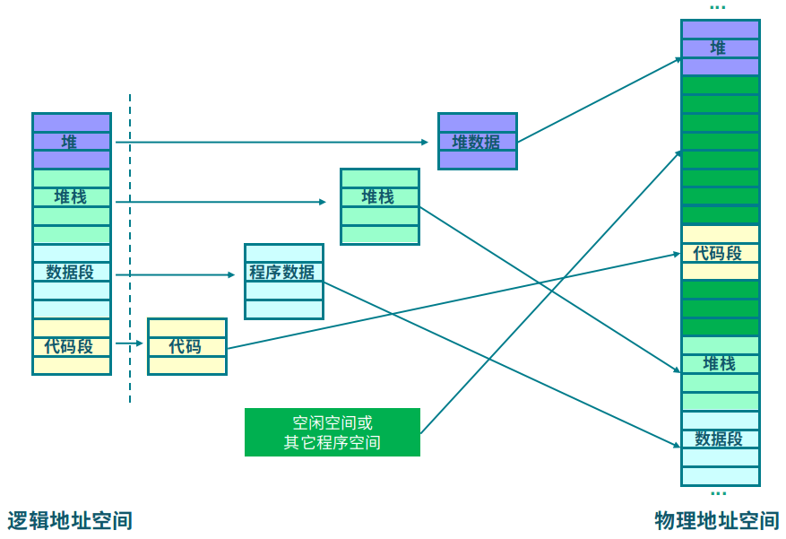
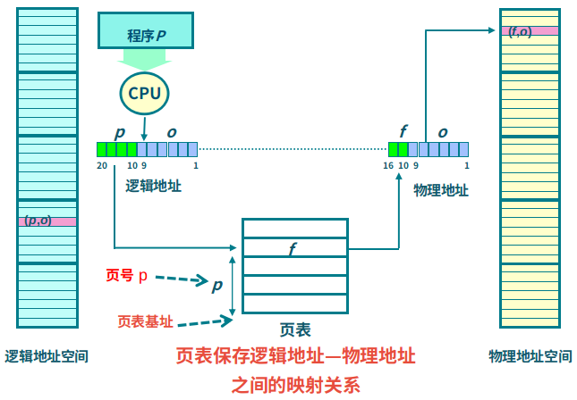

# 物理内存管理
>本文是`操作系统系列`第三篇，介绍物理内存管理。操作系统对内存的管理是非常复杂的，和程序的执行、硬件、编译器等密切相关。本文从物理内存入手，介绍内存管理的重要概念，也为后续的虚拟内存管理内容做铺垫。[原文链接](
https://mp.weixin.qq.com/s/88X9lPpZuQVZ8LRKMDzgHA
)，更多内容见公号`机器学习与系统`，欢迎与我互动~

## 内存管理的需求
2. 抽象，即给每个程序逻辑地址空间
3. 保护，不同程序的地址空间互相隔离，无法越界访问
4. 共享，对于一些公共函数库，可以只在内存中存一份，其它程序引用这一个库即可
5. 虚拟化，通过逻辑地址和虚拟内存，可以使用更大的地址空间

## 地址的概念
地址是用来标志存储资源位置的，在计算机中用一串二进制数据表示。

一. 地址空间

地址空间就是指地址的范围，从最小值到最大值：
- 物理地址空间从0到物理内存的最大值：0~MAX_sys
- 逻辑地址空间从0到程序虚拟内存范围的最大值：0~MAX_prog

下图展示了物理地址空间，进程A、B的逻辑地址空间。

二. 地址生成

物理地址是已经确定的，逻辑地址的生成依赖于**编译器**。

1. 编译：将高级语言编译成汇编语言。假设此时此时地址已知，如果起始地址改变，必须重新编译
2. 汇编：将汇编语言翻译长机器能够识别的二进制代码，里面的地址是该程序执行时，对应地址空间中的位置
3. 链接：将程序执行需要的函数库链接到可执行文件中，更新地址空间
4. **加载**：将函数加载到内存中时根据程序块在内存中的位置更新`逻辑地址空间`内的地址(重定位)
5. 执行：执行代码时，程序在内存中可能会移动，这里需要地址转换(映射)支持

三. 地址解析

下图是CPU和计算机的基本架构，我们以此图来说明物理/逻辑地址在CPU和计算机中如何被解析处理的。

1. 首先，CPU中的算数逻辑单元看到的都是逻辑地址
2. 当CPU需要把数据写入内存或从内存中读取时，MMU会把逻辑地址转换成对应的物理地址
3. 控制逻辑把数据、操作请求和物理地址发送到总线，分为读请求和写请求
    - 写请求，则把数据写入内存
    - 读请求，则把数据从内存中读取发送给CPU

**在上面的过程中，MMU负责逻辑地址和物理地址之间的转换，操作系统负责建立逻辑地址和物理地址之间的映射关系**。

## 连续内存分配
### 基本概念
1. 连续内存分配：给程序分配一块**连续内存区域**
2. 内存碎片：内存上一些没有被分配利用的区域
    - 内部碎片：某个程序分配的内存没有充分利用。是否产生取决于分配算法，比如**分配的内存大小是否要取整**
    - 外部碎片：被分配的内存区域之间没的的空闲区域
3. 碎片整理：通过调整进程占用的内存区域位置来减少或避免分区碎片
4. 碎片紧凑：通过移动分配给进程的内存区域，以合并外部碎片。要求运行的程序都可以动态重定位

### 动态分配
当程序被加载时，根据进程的实际需要动态分配内存空间，使分配的大小刚好与作业的大小相等。动态分区分配并不预先将内存划分成一块块分区，而是在程序进入内存时，根据程序的大小动态地建立分区，因此系统中分区的大小是可变的，分区的数目也是可变的。

有以下三种分配策略：
1. 最先匹配(First-fit)：分配N个字节，`使用第一个可用空间比N大的内存块`。如分配400 byte的内存块，按照从上到下的查找顺序，应该分配`1K byte`内存区域。如果是从下往上查找，应该分配`5K byte`的区域。

2. 最佳匹配(Best-fit)：分配N字节分区时，`查找并使用不小于N的最小空闲分区`。如果要分配2800 byte，应该分配`3K byte`区域。

3. 最差匹配(Worst-fit)：分配N字节，`使用尺寸不小于N的最大空闲分区`。如果分配800 byte，则选择`5K byte`区域。

上述三种分区算法，在释放分区时，都要检查是否能和周围的分区合并。

## 非连续内存管理
连续内存分配会出现内/外部碎片、动态修改比较困难、内存必须连续，而且内存利用率不高。因此提出了非连续内存分配的方法，允许程序使用非连续的内存空间、允许共享代码和数据，以提高内存利用效率和管理的灵活性。

当然，这也带来了挑战：非连续内存分配中，如何有效实现和管理逻辑地址和物理地址间的映射。

下面介绍三种方式：
- 段式存储管理(segmentation)
- 页式存储管理(paging)
- 段页式存储管理(上面两者的综合)

### 段式存储管理

段(segment)指一类地址空间，一个段就是一个地址连续的内存块，若干个段组成程序的逻辑地址空间。

每个段由0到最大的线性地址序列构成。各个段的长度可以是0到某个允许的最大值之间的一个数。**不同的段的长度可以不同(通常情况下也都不一样)，段的长度在运行期间可以动态改变**，比如push数据时，堆栈段的长度会增加，pop时会减少。段也可以被装满，但是通常情况下段的长度很大，这种情况很少发生。

段式存储管理下的逻辑地址组成格式为(s, o)，s为`段号`，o为`段内偏移量`，段号和对应内存中的物理起始地址由`段表`记录。寻址时，先根据段号到段表中查到物理起始地址(基址)，然后加上偏移量，得到最终的物理地址。

### 页式存储管理
页式存储管理有两个至关重要的概念：
1. 物理页帧(Frame | Page Frame | 帧 | 页帧)：把物理地址空间分成大小相同的基本单位。大小为2^n，如512/4096等。
2. 逻辑页面(Page | 页)：把逻辑地址空间划分为相同大小的基本单位
3. **页帧大小和页面大小必须一致**

页式存储管理的寻址方式和段式管理类似，逻辑地址格式为(p, o)，表示**页**中的地址，其中p表示页号，o表示偏移量。物理地址格式为(f, o)，表示**页帧**中的地址，其中f表示页帧号，o表示偏移量，页偏移量和页帧偏移量是相等的。

页和页帧的对应关系使用**页表(Page Table)**来管理。寻址时首先根据页号找到页表中对应的页帧号，然后用得到的页帧号与偏移量组成实际的物理地址。

页面和页帧的大小相比分段要小得多，假设系统是32位，页帧大小1024字节，这样有2^32/2^10=2^22条页表记录，查询页表的时间要多很多。下面介绍两个提高性能的方法：
1. 使用快表(Translation Look-aside Buffer, TLB)：直译为旁路快表缓冲，可以理解为页表缓冲。即在内存和CPU之间搭建页表缓存，寻址时先到TLB中查找，未命中再到内存中的快表查找
2. 多级页表：(p1, p2, o)是两级页表的虚拟地址表示，先根据p1查找页表1中的p2，再根据p2查询真正的页帧号，然后根据偏移地址o查到最终的物理地址

### 分段和分页的比较
分页和分段系统有许多相似之处。两者都采用离散分配方式，且都要通过地址映射机构来实现地址变换。但在概念上两者完全不同，主要表现在下述三个方面：
1. 页帧是信息的物理单位，分页是为了实现非连续分配，以便解决内存碎片问题, 提高内存的利用率。段是信息的逻辑单位，分段的目的是为了能更好地满足用户的需要。 
2. 页的大小固定且由系统决定，由系统把逻辑地址划分为页号和页内地址两部分，是由机器硬件实现的，因而在系统中只能有一种大小的页面。而段的长度却不固定，决定于用户所编写的程序，通常由编译程序在对源程序进行编译时，根据信息的性质来划分。

段式存储和页式存储都是为了更好管理内存，段式从程序的角度入手，页式从物理底层的角度入手，在理解上，可以结合两者的优缺点进行选择：

|| 分段 | 分页 |
|:---:|:---:|:---:|
| 优点 | 段长可动态修改，方便编程，分段共享，分段保护，动态链接，动态增长 | 非连续分配，减少内存碎片，提高内存利用效率 |
| 缺点 | 内部碎片，地址计算需要更多硬件支持 | 需要两次内存访问，页表可能很大 |

### 段页式存储管理
段页式存储管理充分利用了段式存储在内存保护方面有优势，页式存储在内存利用和优化转移到后备存储方面有优势。

在段式存储管理基础上，给每个段加一级页表。逻辑地址格式为(s, p, o)，s为段号，p为页号，o为页内偏移。寻址时，现根据段号s查找段表中的页表地址，然后到页表中查找p对应的起始地址，最后加上偏移o得到最终的物理地址。

## 总结
程序在执行时，CPU看到的是逻辑地址，当CPU读写数据时，由MMU根据逻辑地址找到对应的物理地址，然后到总线上读写数据。通过这种管理机制，可以更好地管理内存，在多道程序执行中做到隔离和共享。

## Reference
- [操作系统-精髓与设计原理](https://u.jd.com/31VMmQ)
- [清华大学OS课程](http://os.cs.tsinghua.edu.cn/oscourse/)
- [部分配图来自清华大学OS课程PPT](http://os.cs.tsinghua.edu.cn/oscourse/)
- [连续分配方式 -- 动态分区分配](https://blog.csdn.net/dongyanxia1000/article/details/51700179)
- [学堂在线-操作系统课程](https://next.xuetangx.com/course/THU08091000267/1516699)
- [分段，分页与段页式存储管理](https://blog.csdn.net/zephyr_be_brave/article/details/8944967)
- [TLB的作用及工作过程](https://www.cnblogs.com/alantu2018/p/9000777.html)