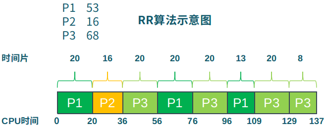
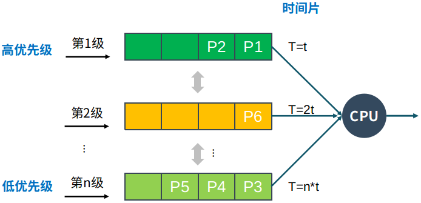

# 进程是如何调度的？
>本文是`操作系统系列`第四篇文章，介绍处理机调度进程相关算法。进程调度的算法和调度框架(Kubernetes)类似，可以相互借鉴。[原文链接](https://mp.weixin.qq.com/s/s5C_OHhfsxZmlev8QgsWvw)，更多内容见公号`机器学习与系统`，欢迎与我互动~

## 概念
发生进程切换时，本质是CPU资源占用者间的切换。此时需要保存当前进程在PCB中的执行上下文(CPU状态)，然后恢复下一个进程的执行上下文。

处理机调度涉及两个方面，一是选择进程：从就绪队列中挑选下一个占用CPU运行的进程。二是选择CPU资源：从多个可用CPU中挑选就绪进程可使用的CPU资源。

## 准则
调度策略是指确定如何从就绪队列中选择下一个执行进程，可以理解为调度算法。评价算法的基准有以下几个：
1. CPU使用率：CPU处于忙状态的时间百分比
2. 吞吐量：单位时间内完成的进程数量
3. 周转时间：进程从初始化到结束(包括等待)的总时间
4. 就绪等待时间：进程在就绪队列中的总时间
5. 响应时间：从提交请求到产生响应所花费的总时间

另外，处理机调度需要保证公平：
1. 保证每个进程占用相同的CPU时间
2. 保证每个进程的等待时间相同

## 算法
### 先来先服务算法(FCFS: First Come, First Served)
FCFS依据进程进入就绪状态的先后顺序排列，它简单、易于实现。

但是也存在一些缺点，以上图为例，进程到达次序不同，对周转时间影响较大。总结如下：
1. 平均等待时间波动较大：短进程可能排在长进程后面
2. I/O资源和CPU资源的利用率较低：CPU密集型进程会导致I/O设备闲置时，I/O密集型进程也等待

### 短进程优先算法(SPN)
SPN是FCFS算法的改进，它选择预期执行时间最短进程占用CPU进入运行状态。SPN算法的优点是具有最优平均周转时间。缺点：
1. 可能导致饥饿：连续的短进程流会使长进程无法获得CPU资源
2. 需要预知未来：如何评估进程执行时间的长短？一个方法是基于历史数据估计

### 最高响应比优先算法(HRRN: Highest Response Ratio Next)
选择就绪队列中响应比R值最高的进程，R计算方法如下：  
Ｒ＝（ｗ+s)/s  
w: 等待时间(waiting time)  
s: 执行时间(service time)  

### 时间片轮转算法(RR: Round Robin)
RR算法是对FCFS的改进，在FCFS的基础上加入对进程执行时间(CPU时间片)的限制。当进程的时间片用完后，按照FCFS的规则选择下一个进程。

上图是RR算法的示意图，三个进程按照P1、P2和P3的顺序到达，执行时间分别为53、16和68。基准数据如下：
1. 等待时间
   - P1=(56-20)+(96-76)=56
   - P2=(20-0)=20
   - P3=(36-0)+(76-56)+(109-96)=56+13=69
2. 平均等待时间：(56+20+69)/3=48.33

RR算法主要开销在进程的上下文切换，重点是选择合适的时间片(delta)。
- delta过大，进程的等待时间过长，易退化成FCFS
- delta过小，反应快，但是上下文切换频繁，影响系统吞吐量

根据经验规则，delta应保证上下文切换开销处于1%以内。

### 多级队列调度算法(MQ)
该算法的思想是把就绪队列根据更细的维度划分成不同的子队列，不同队列选择不同的算法。如`前台交互就绪队列`和`后台批处理就绪队列`，前台使用RR，后台使用FCFS。

### 多级反馈队列算法(MLFQ: Multi Level Feedback Queues)

将就绪队列中进程按照不同的优先级分成不同的队列，优先级越高时间片反而越小，进程可以在不同的队列间移动，如进程在当前的时间片没有完成，则降到下一个优先级。

MLFQ算法中，CPU密集型进程的优先级下降很快，I/O密集型进程停留在高优先级。

### 公平共享调度算法(FSS: Fair Share Scheduling)
FSS强调资源的公平分配，对用户进行分组。用户组比其他用户组更重要，则分配更多的资源。未使用的资源按比例分配，没有达到资源使用率目标的组获得更高的优先级，这样就避免不重要的用户垄断资源。

### 传统算法总结
| 算法 | 特点 |
|:---|:---|
| 先来先服务算法(FCFS) | 不公平，平均等待时间较差 |
| 短进程优先算法(SPN) | 不公平，平均等待时间较差 需要精确预测计算时间 可能导致饥饿 |
| 最高响应比优先算法(HRRN) | 可能导致饥饿 不可抢占 |
| 时间片轮转算法(RR) | 可能导致饥饿 |
| 多级反馈队列算法(MLFQ) | 多种算法的集成 |
|  公平共享调度算法(FSS)| 强调公平 |

## 实时调度
对时间的要求很严格，要求操作系统在一定时间内完成相应功能。它的性能指标有两个：
- 时间约束的及时性(deadlines)
- 速度和平均性能相对不重要

实时操作系统可分为两类：
- 强实时操作系统：指定的时间内必须完成重要的任务
- 弱实时操作系统：重要进程有高优先级，要求尽量但非必须完成

实时调度算法：
1. 速率单调调度算法(RM, Rate Monotonic)
   - 通过周期安排优先级
   - 周期越短优先级越高
   - 执行周期最短的任务
2. 最早截止时间优先算法(EDF, Earliest Deadline First)
   - 截止时间越早优先级越高
   - 执行截止时间最早的任务

## 多处理机调度
即多个处理机组成一个多处理机系统，处理机间可负载共享。

### 对称多处理器(SMP, Symmetric multiprocessing)调度
该调度中，每个处理器运行自己的调度程序，调度程序对共享资源的访问需要进行同步。在分配进程时有静态进程分配和动态进程分配。
1. 静态进程分配
   - 进程从开始到结束都被分配到一个固定的处理机上执行
   - 每个处理机有自己的就绪队列
   - 调度开销小
   - 各处理机可能忙闲不均
2. 动态进程分配
   - 进程在执行中可分配到任意空闲处理机执行
   - 所有处理机共享一个公共的就绪队列
   - 调度开销大
   - 各处理机的负载是均衡的

## 优先级反置
优先级反置是一种现象，发生在基于优先级的调度算法中，即高优先级进程等待低优先级进程的现象。主要原因是资源的占用现象，低优先级占用资源，等待资源使用结束后才能释放资源，需要相同资源的高优先级进程就需要等待。

下面介绍两个解决方法。

1. 优先级继承(Priority Inheritance)：简单说就是升高占用资源的低优先级进程的优先级，升高成等待资源的高优先级进程。
2. 优先级天花板协议(priority ceiling protocol)：占用资源进程的优先级和所有可能申请该资源的进程的最高优先级相同。

## 总结
本文介绍了操作系统中进程调度的算法，包括单处理器和多处理器。调度算法的应用很广泛，从操作系统中的进程到Kubernetes中的Pod调度等，值得深入学习，顺便给自己埋个坑，希望完成调度算法系列...