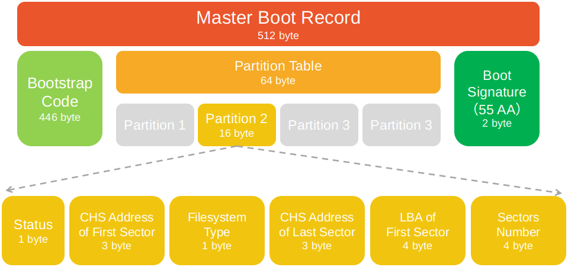
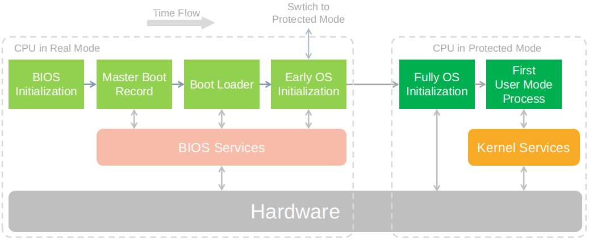

# 计算机系统启动过程
>本文是`操作系统系列`的第一篇文章，以BIOS-MBR启动过程为例，介绍计算机系统是如何启动的。[原文链接](https://mp.weixin.qq.com/s/aTgt3d2iddsJCXRKv0ACFg)，更多内容见公号`机器学习与系统`，欢迎与我互动~

## 概览
计算机系统的启动过程是非常复杂的，也诞生了很多流派，比如BIOS-MBR启动方式、UEFI-GPT启动方式等。不管是哪个流派，广义上的启动过程是类似的，以BIOS-MBR为例，可以简化为如下步骤：
1. 计算机通电，硬件初始化
2. 执行BIOS，进行硬件检测，确定启动设备
3. 主引导记录(MBR)，包含引导操作系统的相关信息
4. 启动加载器，开始于MBR中的加载程序，结束语操作系统运行
5. 执行操作系统内核，计算机完成启动

## 计算机通电
计算机通电后，CPU中的执行地址会初始化为BIOS的地址，然后开始加载执行BIOS程序。这里面的BIOS程序是笔记本厂商出厂时就写入到ROM中的。至于ROM中BIOS的执行地址，则根据**处理器手册约定值进行设定**。

不同的CPU在执行BIOS前的操作不同，以x86指令集架构CPU为例，指令地址由CS、IP两个寄存器构成，CS:IP初始化指向ROM中的一条指令，该指令是跳转指令，它跳转到BIOS的地址。而且，该CPU启动过程中，还需要完成从实模式到保护模式的转变。

## BIOS
BIOS全称基本输入输出系统(Basic Input/Output System)，它主要提供以下几个功能：
1. 硬件接口，提供基本和硬件交互的接口，如基本的输入/输出功能
2. 进行硬件检测，读取硬件信息
3. 查找并加载可启动设备

### 硬件接口
BIOS首先提供的就是基本的输入/输出功能，通过中断的方式实现，比如`INT 10h: 字符显示`、`INT 13h: 磁盘扇区读写`、`INT 15h: 检测内存大小`和`INT 16h: 键盘输入`。

通过这些功能，用户可以设置启动顺序，也支撑后面的硬件自检。

### 硬件自检
BIOS运行后，首先进行通电自检(Power-On Self-Test)。这一过程中，会对CPU、内存等设备进行检测，查看是否有异常，如果有异常，会发出对应错误信息(如蜂鸣声)。接着会对硬件进行初始化，比如：
- 初始化内存，让CPU得以访问这些硬件
- 监听I/O总线，识别连接到计算机上的硬盘、网卡、PCI等设备

完成检测之后，BIOS 会输出检测结果，相关的硬件配置也会被更新到 CMOS 存储器上。

### 启动设备
完成通电检测之后，BIOS会寻找第一个启动设备。

启动设备里存放着操作系统代码和启动配置信息。计算机可以有多个硬件启动设备，如硬盘、优盘、DVD、网络启动设备等。BIOS根据开机检测得到可启动的设备列表，默认从第一个设备启动，用户可以进入BIOS设置启动顺序。下面是寻找并加载启动设备的简单过程：
1. 读取启动设备第一个扇区中的内容到内存，并跳转到该地址执行扇区中的启动代码
2. 如果设备内容不合法，则回到BIOS，按照启动顺序加载下一个启动设备。直到找到可启动的设备，如果没有，则发出异常。

## 主引导记录
BIOS-MBR启动流派中，启动设备的第一个扇区的内容称为`主引导记录`(MBR，Master Boot Record)，它的结构如下：

1. 第1-446字节：启动过程比较简单的话，这部分代码会加载操作系统到内存，然后跳转到内存上的OS执行代码，完成启动过程。如果启动过程很复杂，启动代码会加载并执行另一个程序，由该程序完成后续启动过程
2. 第447-510字节：设备分区表(Partition table)，描述4个主分区的详细信息，包括该分区的起始位置、文件系统和可用状态等
3. 第511-512字节：主引导记录签名(0x55和0xAA)，标志当前扇区是否合法，不合法(不是55AA)，会跳回BIOS寻找下一个启动设备

### 启动代码
简单来讲，启动代码负责把扇区中的操作系统代码加载到内存，然后执行操作系统代码。对于不同的操作系统，这一加载过程可能会有所不同。

这部分只有446字节，启动代码能做的事情是有限的，

## 启动管理器
启动管理器(BootLoader)主要工作是把操作系统代码加载到内存，然后跳转到内存执行操作系统代码。

如果启动过程很简单，比如MBR中的启动代码直接加载执行操作系统代码，那么MBR中的启动代码就可以理解为启动管理器。

对于复杂的启动过程，加载操作系统代码由一系列软件完成，我们就认为这一些列软件构成`启动管理器`。**它开始于MBR的启动代码，结束于系统内核的启动**。

## 操作系统
内存中的操作系统开始执行，首先运行的是内核程序。以Linux为例，内核加载成功后，第一个运行的程序是`/sbin/init`，它根据配置文件(Debian系统是/etc/initab)产生init进程。这是Linux启动后的第一个进程，pid进程编号为1，其它进程都是它的后代。

然后，init线程加载系统中的各个模块，比如窗口管理器和网络管理器，直至执行用户登录程序，跳出登录界面，等待用户输入用户名和密码。

至此，启动过程完成。

## 相关问题
### 为什么BIOS不直接加载OS代码？
1. 磁盘上是文件系统，**文件系统多种多样**，BIOS程序很小，无法兼顾这些文件系统。
2. 所以实现一个能识别文件系统类型的加载程序(bootloader)，由bootloader来加载OS代码。
3. bootloader按照约定存在磁盘的**第一个扇区**，并且遵循一定的格式。

### 为什么MBR启动过程不支持大于2TB的硬盘？
主引导记录中规定了启动设备的分区和详细信息，每个扇区大小为512字节，MBR分区表中规定扇区数量的大小为4字节。一个字节是8bit，4字节就是32bit，能表示的最大数是2^32。这样最大扇区数=512byte*2^32位=2TB。

综上，MBR能支持的最大硬盘的大小取决于扇区的大小和扇区数。这两个数得到的上限是2TB。

## 总结

BIOS-MBR启动过程是经典的计算机启动过程，它的很多思想对后续的启动过程有很多影响。但是它不是唯一的启动过程，因为诞生比较早，存在一些缺陷，更现代的启动流派是UEFI+GPT方式。

## 参考
- [计算机是如何启动的？](https://liamlin.me/2019/09/06/booting-a-pc)
- [计算机是如何启动的？](http://www.ruanyifeng.com/blog/2013/02/booting.html)
- [清华大学-操作系统(2020春)](https://next.xuetangx.com/learn/THU08091000267/THU08091000267/1516699/video/1405127)
- [百度百科-主引导记录](https://baike.baidu.com/item/%E4%B8%BB%E5%BC%95%E5%AF%BC%E8%AE%B0%E5%BD%95)