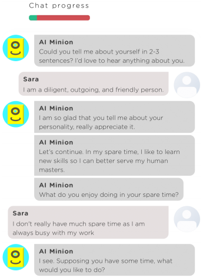
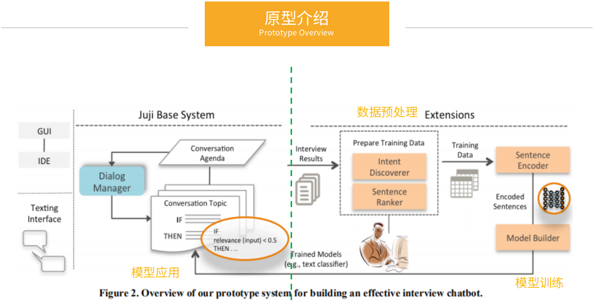

# 使用人工智能技术改进面试机器人
>写于2020.5.02

论文的内容架构很鲜明，围绕`问题定义`、`解决方案`和`原型验证`三条线介绍研究成果。

## 问题与解决方案

针对面试机器人的应用场景，存在以下几个问题：
1. 面试中有很多开放性问题，候选人的回答是五花八门的，如何理解用户输入、高效响应用户？
2. 目前市场上面试机器人处理复杂对话场景依然困难。
3. 由于机器人部署人员缺少人工智能知识，他们很难利用人工智能技术来改进对话机器人。

作者提出，**通过人工智能技术，在面试机器人中引入积极聆听技能**，让机器人更好地理解用户，提高面试效果和用户体验。

>Tips：什么是`积极聆听`？
>`积极聆听`是一种沟通技巧，在沟通过程中一方适时提出开放式问题、鼓励对方、表达感受、总结等，达到高效沟通的目的。
>因此这种技巧可以帮助面试官更好理解并回应对话伙伴。
>已经证明，积极聆听能够引起更高质量的回答，使面试官更具社会吸引力。这不仅适用口语交流，也适用线上机器人文本对话。

## 原型验证
**实现积极聆听的核心是利用人工智能技术预测用户意图**。

在调研市场上的聊天机器人后，文章提出了**基于规则和数据驱动的混合框架**，即选择基于规则的[Juji Chatbot 平台](https://juji.io/)，对其进行扩展，通过人工智能技术来预测用户的意图。具体是先设定一个基本的面试规则，然后针对特定面试主题预先训练模型，使用这个规则初始化一个Chatbot，然后接入模型，通过规则和模型响应用户输入。在使用过程中，面试机器人会不断学习改进模型，渐进式提高自己。

## 特色
这篇文章的优点就是提出了基于规则和数据驱动的混合框架来改进面试机器人。机器人使用预先设计好的规则初始化，然后接入AI能力，通过训练好的模型响应用户输入。赋予面试机器人`积极聆听`的技能，可以产生情感共鸣，更好响应用户，提升面试效率和用户体验。

上述的研究思想总结到人机交互领域，有以下几个优势：
1. 采用“实践的方法”，不是纸上谈兵，而是通过开发原型和实践来验证效果。
2. 混合与渐进式设计思路：混合指Chatbot采用规则和数据驱动的混合方法，渐进式指并在实践中通过学习不断改进。
3. 思路可以扩展到更多的Chatbot场景，而不仅仅是面试场景。

## 局限与改进
1. 积极聆听的技巧有很多，当用户输入对应多个技巧时，机器人不能明确使用哪一个，而是随机选择。
2. 模型不能预测用户更深入的意图。目前是基于用户输入的语义段预测，得到概括性的结果，没有深入分析内容中各个概念之间的联系。
3. 模型独立对待面试主题，没有分析各个主题之间的关联。
4. 不支持积极聆听中的提问技巧，即不会主动提问。
5. 面试主题不多，文章只选择了4个常用主题来评估。
6. 没有评估原型的易用性

## 总结
1. 本文将基于规则和数据驱动的方法结合起来，赋予面试机器人**积极聆听的技能**。
2. 在开放式面试问题中，机器人能够更好地处理复杂和多样的用户回答。
3. 提供更好的用户体验和更高质量的响应。

## 参考
- [论文地址：If I Hear You Correctly: Building and Evaluating Interview Chatbots with Active Listening Skills](https://dl.acm.org/doi/abs/10.1145/3313831.3376131)
- [积极聆听](https://baike.baidu.com/item/%E7%A7%AF%E6%9E%81%E8%81%86%E5%90%AC/2734827)

>文章持续更新，关注阅读最新内容，回复**资料**、**内推**、**考研**获取我准备的惊喜~