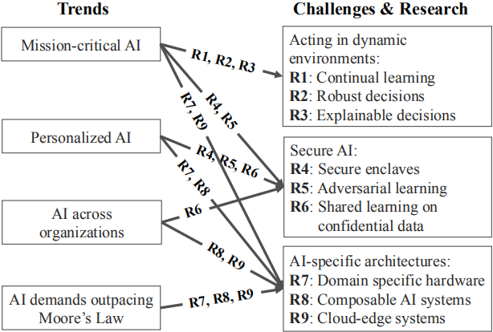

# 人工智能在系统领域面临的挑战--伯克利视角
>写于2020.5.12

人工智能已经从实验室进入到生产和商业应用，这将带来新的挑战。但是随着摩尔定律的终结，通过增加计算能力和存储能力将无法解决下一代AI系统面临的挑战。因此这篇文章提出了在系统、体系结构和安全等多个开放性研究方向。

# 趋势和挑战
## 1. Mission-critical AI
关键任务AI，比如自动驾驶、家庭机器人助理等，这些场景中人类的生命很重要。

挑战在于：设计通过和动态环境交互，从而持续学习的AI系统，同时能够做出安全、及时、健壮的决策。

## 2. Personalized AI
个性化AI

挑战在于：设计出提供个性化应用和服务的同时，不损害用户隐私和安全的AI系统。

## 3. AI across organizations
跨组织AI，一些公司/组织可能需要使用**第三方数据**来增强AI的场景。

挑战在于：设计出能够在**不影响数据集保密性**的情况下，对不同组织拥有的数据集进行训练的AI系统，并且提供更好的AI能力。

## 4. AI demands outpacing the Moore’s Law
AI的要求超过了摩尔定律

处理和存储巨量数据的能力成为影响AI成功的关键因素。一方面，数据程指数级增长；另一方面，我们的硬件技术面临停滞不前的挑战，DRAM和硬盘的存储容量10年后才会翻倍...

挑战在于：开发特定领域的体系结构和软件来满足后摩尔时代AI应用的性能需求。比如面向AI工作负载的定制化芯片，边缘云计算系统（在终端处理数据和计算），新的收集、处理数据的技术等。

# 研究机会

## AI专用体系结构
### Composable AI systems
可组合的人工智能系统

当前的AI系统代码仓库是庞大(臃肿)、单一的，难以开测、测试和迭代。

在模型组合上，也存在许多待解决的挑战。比如：
1. 设计一种声明式语言，它可以获取模型组件的拓扑结构，并根据拓扑关系指定应用程序的性能目标
2. 为每个组件提供准确的性能模型，包括资源需求、延迟和吞吐量
3. 提供调度和优化算法来计算多个组件的执行计划，并将组件映射到可用资源上，以最低的成本满足延迟和吞吐量要求

研究方向：
>Design AI systems and APIs that allow the composition of models and actions in a modular and ƒflexible manner, and develop rich libraries of models and options using these APIs to dramatically simplify the development of AI applications.

设计AI系统和相关API，以模块化和灵活的方式构建模型和动作，并利用这些API开发丰富的模型和选项库，达到极大简化AI应用开发的目的。

如果你关注Berkeley的RISELab，他们针对这一研究方向开发了[Ray](https://github.com/ray-project/ray/)这一软件。

### Domain speci€c hardware
领域专用硬件

研究方向：
1. Design domain-speci€c hardware architectures to improve the performance and reduce power consumption of AI applications by orders of magnitude, or enhance the security of these applications.
2. Design AI soft‡ware systems to take advantage of these domain-speci€c architectures, resource disaggregation architectures, and future non-volatile storage technologies.

### Cloud-edge systems
边缘云计算系统

研究方向：
Design cloud-edge AI systems that
1. leverage the edge to reduce latency, improve safety and security, and implement intelligent data retention techniques
2. and leverage the cloud to share data and models across edge devices, train sophisticated computationintensive models, and take high quality decisions.

## 动态环境中的行为
### Continual learning
持续学习研究

研究方向：
1. Build systems for RL that fully exploit parallelism, while allowing dynamic task graphs, providing millisecond-level latencies, and running on heterogeneous hardware under stringent deadlines.
2. Build systems that can faithfully simulate the real-world
environment, as the environment changes continually and unexpectedly, and run faster than real time

### Robust decisions
健壮的决策

研究方向：
1. Build €ne grained provenance support into AI systems to connect outcome changes (e.g., reward or state) to the data sources that caused these changes, and automatically learn causal, source-speci€c noise models.
2. Design API and language support for developing systems that maintain con€dence intervals for decisionmaking, and in particular can ƒag unforeseen inputs

### Explainable decisions
可解释的决策

研究方向：
Build AI systems that can support interactive diagnostic analysis, that faithfully replay past executions, and that can help to determine the features of the input that are responsible for a particular decision, possibly by replaying the decision task against past perturbed inputs. More generally, provide systems support for causal inference

## 安全
### Secure enclaves
安全边界

研究方向：
Build AI systems that leverage secure enclaves to ensure data con€dentiality, user privacy and decision integrity, possibly by spliˆing the AI system’s code between a minimal code base running within the enclave, and code running outside the enclave. Ensure the code inside the enclave does not leak information, or compromise decision integrity.

### Adversarial learning
对抗学习

研究方向：
Build AI systems that are robust against adversarial inputs both during training and prediction (e.g., decision making), possibly by designing new machine learning models and network architectures, leveraging provenance to track down fraudulent data sources, and replaying to redo decisions a‡er eliminating the fraudulent sources.

### Shared learning on con€dential data
保密数据上的共享学习

研究方向：
Build AI systems that
1. can learn across multiple data sources without leaking information from a data source during training or serving
2. and provide incentives to potentially competing organizations to share their data or models

## 参考
- [A Berkeley View of Systems Challenges for AI](https://arxiv.org/pdf/1712.05855.pdf)
- [Awesome-System-for-Machine-Learning](https://github.com/HuaizhengZhang/Awesome-System-for-Machine-Learning)