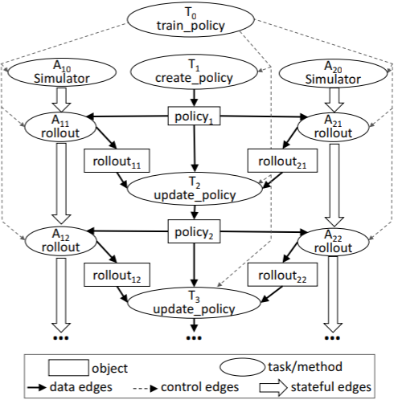
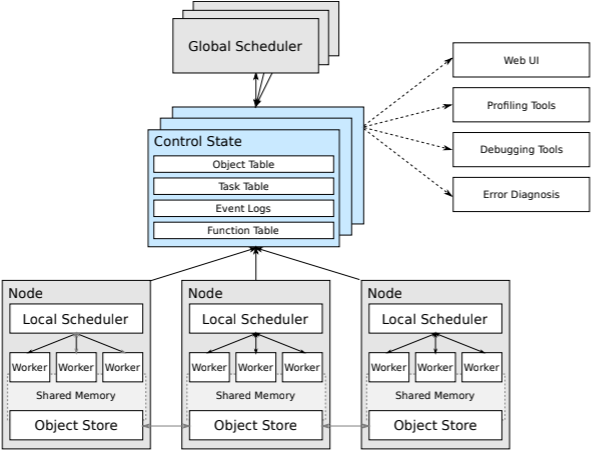
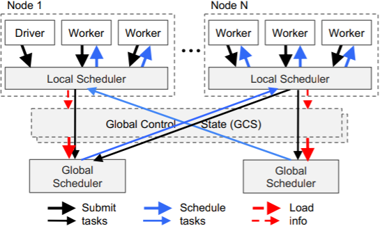

# Ray简介，面向新兴AI应用的分布式框架

下一代AI应用需要不断和环境进行交互，并且在交互中学习。这些应用暴露了新的系统需求：性能和弹性。本文提出了Ray解决上述问题。

Ray实现了动态执行引擎，可以表达任务并行和actor模型计算任务。它通过分布式调度器以及分布式容错存储来实现高性能与容错。

# 问题与方案
AI中的监督学习部分，已经出现了优秀的深度学习框架，使用定制的硬件加速计算。但是对于新兴的AI应用不仅要收集探索数据，还要采取动作不断和环境交互学习，这一类可以概括为强化学习。

强化学习提出了新的系统需求：
1. 支持细粒度计算
2. 支持动态执行，RL需要模拟
3. 支持多样的资源：时间、CPU、内存等

**因此，新兴RL应用需要动态计算框架，每秒处理百万级任务且延迟在毫秒级**。

当前的一些框架无法完全满足上面的要求：
1. 像MapReduce、Spark、Dryad一类BSP模型框架不支持细粒度模拟或策略服务
2. CIEL和Dask的任务并行框架对分布式训练和模型服务支持很少
3. 分布式深度学习框架TensorFlow、MXNet不天然支持模拟和服务

因此，如果要开发端到端解决方案，需要使用不同的计算组件，分布式训练、模拟、模型服务等都需要一个组件。这种方法会带来大量的开发负担，而且系统紧耦合，不实用。

所以，Ray的目标是成为一款通用的计算计算框架，同时支持RL中的模拟、训练和服务这些需求。计算负载包括模拟这样的轻量、无状态的计算，也包括向训练这样长时、有状态的计算任务。对于无状态任务，Ray提供了Task抽象，对于有状态任务，Ray提供了actor抽象。这些抽象是建立在底层动态执行引擎上的。

Ray的贡献如下：
1. 设计和实现了第一个统一训练、模拟和服务的分布式框架
2. 基于动态执行引擎实现了task和actor并行抽象
3. 将控制状态存储在共享的元数据存储中，其它系统组件都是无状态的
4. 自底向上的分布式调度策略

# 编程与计算模型
Ray实现了动态任务图计算模型，将应用建模成调度图中独立的计算任务。

## 编程模型
1. Task表示可以在无状态worker节点上执行远程函数(remote function)。远程函数是无状态且幂等的，相同的输入输出相同，这样易于容错。
2. Actors，表示有状态的计算，每个actor会暴露一些方法，可以被远程调用或顺序执行。actor的方法只会在有状态的worker上执行。

下面的表格是Task和Actor的比较：
|         Task(stateless)         |        Actors(stateful)        |
| :-----------------------------: | :----------------------------: |
|   Fine-grained load balancing   | Coarse-grained load balancing  |
|   Support for object locality   |     Poor locality support      |
| High overhead for small updates | Low overhead for small updates |
|   Efficient failure handling    |  Overhead from checkpointing   |

## 计算模型
Ray采用了动态任务图计算模型，这种模型中，当输入准备好后，task和actor的方法会自动被系统调用执行。

上面的图就是一个动态任务图，这个图包含三种类型的边：
1. 数据边，表示数据依赖关系
2. 控制边
3. 有状态边

图中有两种类型的节点：
1. 对象节点，包含有状态信息
2. 任务/远程函数调用，无状态函数/方法

在任务图中，Ray会维护数据间的依赖世系，当某个task或actor的方法崩溃时，可以快速恢复丢失的数据。

# 系统架构
下图是[Ray早期论文](https://arxiv.org/abs/1703.03924)中的整体架构，包含的组件更全面，对架构可以有一个整体的认识。

Ray的架构分为两层，上层为应用层，为用户提供简炼、易用的API；下层为系统层，提供高可用、容错的执行引擎。

## 应用层
由三种类型的进程构成：
1. *Driver*：用于执行用户程序
2. *Worker*：自动运行的`无状态`进程，由系统层分配任务。会串行执行driver或其它worker触发的任务。
3. *Actor*：有状态进程，只能由dirver或worker实例化。

## 系统层
包含三个主要的组件：全局控制存储、分布式调度器和分布式对象存储。

### Global Control Store(GCS)
全局控制存储(GCS)维护系统所有控制状态，它的核心是带有发布-订阅功能的键值存储。通过分片实现扩展，每个分片通过[链式备份](https://www.cs.cornell.edu/home/rvr/papers/OSDI04.pdf)实现容错。

**GCS的目的是为每秒百万级任务调度提供容错和低延时**。同时简化了整体架构，使得Ray中的每个组件都是无状态的，组件的调度、扩展、调试、可视化都非常方便

### 自底向上的分布式调度
Ray的一个目标是实现每秒百万级任务调度，为此设计了两级调度器，包括`全局调度器`和每个节点上的`本地调度器`。为了降低全部调度器的负载，节点(worker，actor)上派生的任务首先提交给本地调度器，当本地调度器过载时，会把带调度的任务提交给全局调度器。

全局调度器会根据每个节点的负载和任务的需求进行调度。决策依据有：
1. 每个节点上任务队列的大小
2. 节点上任务的排队时间
3. 任务需要的数据传输到该节点所需的时间

当全局调度器出现瓶颈时，Ray会实例化更多的全局调度器来分担工作，这得益于GCS，使得全局调度器可扩展。

### 内存分布式对象存储
基于内存实现是为了最小化任务的延迟，数据格式使用Apache Arrow。

当任务所需的数据不在本地节点时，数据会从其它节点复制过来。因为认读读写数据都在本地内存中，这极大增加了吞吐量。

内存对象存储是分布式的，但是存储的内容必须作为一个整体存储在一个节点上，不能分割成多个块，存储在多个节点上，Ray没有这样做，因为会增加系统的复杂度。

## 代码实现
截至2017年，Ray主要包含40K行代码，系统层由C++编写，占72%；应用层由Python编写，占28%。

两级调度器都是基于事件驱动(event-driven)的单线程模型。

# 总结
Ray的开发是一段长期旅程，早期它作为分布式训练和模拟的Spark库出现，因无法满足强化学习的要求而独立演进。

Ray提供了无状态(task)和有状态(actor)的通用分布式调度框架，支持训练、服务和模拟整个强化学习周期。通过良好的架构设计支撑了每秒百万级的任务调度，可以很好支撑未来新兴AI应用的需求。

截止到2020年，Ray已经不局限于强化学习任务，而是作为一个**通用的分布式框架**，上层封装了[Tune](https://docs.ray.io/en/latest/tune.html)、[RLlib](https://docs.ray.io/en/latest/rllib.html)、[SGD](https://docs.ray.io/en/latest/raysgd/raysgd.html)、[Serve](https://docs.ray.io/en/latest/serve/index.html)等生态库，为用户提供更多可能，并且专门创办公司[Anyscale](https://anyscale.com/)来推动，这会成为下一个Spark和Databricks吗？我们拭目以待。

# 参考
- [10 分钟了解 Actor 模型](https://www.jianshu.com/p/449850aa8e82)
- [BSP模型](https://zh.wikipedia.org/wiki/%E6%95%B4%E4%BD%93%E5%90%8C%E6%AD%A5%E5%B9%B6%E8%A1%8C%E8%AE%A1%E7%AE%97%E6%A8%A1%E5%9E%8B)
- [Ray官网](https://ray.io)
- [Ray paper](https://arxiv.org/abs/1712.05889)